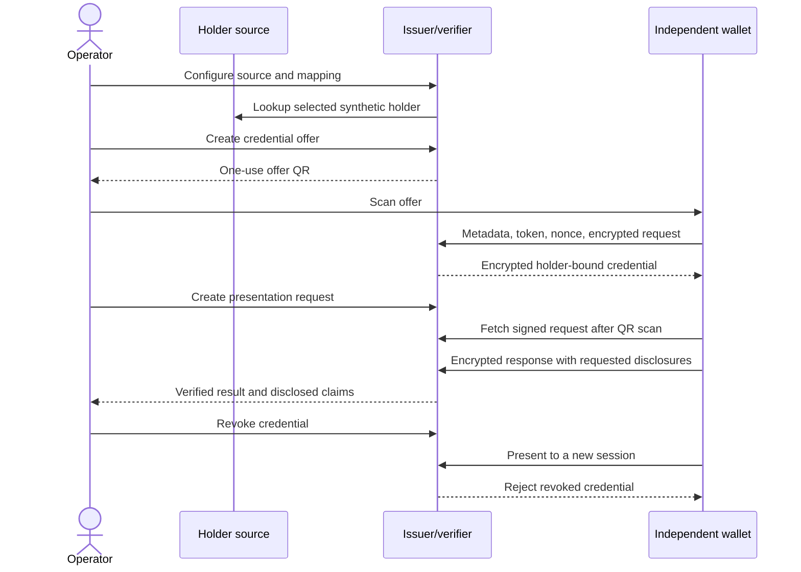

# Live wallet walkthrough

Updated 2026-09-18. Operator guide for the uncommitted VeriCred candidate.
Baseline: [EUDI_ACCEPTANCE_CONTRACT.md](EUDI_ACCEPTANCE_CONTRACT.md).
Evidence: [PRODUCTION_HANDOVER.md](PRODUCTION_HANDOVER.md).

**Current provisioning gate:** attested-key issuance is implemented, but actual wallet-provider and
status signer trust, assurance/certification policy and status paths remain unprovisioned. Sections 3-4
require those agreements and external onboarding before a device pass is possible. See
[wallet attestation provisioning](WALLET_ATTESTATION.md).

## What you can see now

Open **Wallet walkthrough** at `/console/monitor` on the local instance. It connects the actual
source lookup, credential offer, presentation session and revocation APIs. A QR proves an offer
or request exists; only a completed wallet exchange proves issuance or presentation.

| Run | Establishes | Does not establish |
| --- | --- | --- |
| Local Admin walkthrough with synthetic holders | Operator controls and application data flow | Independent wallet acceptance |
| Automated wallet-contract tests | Cryptography/messages against a test client | Android/iOS/miTch compatibility |
| Local TLS tests | HTTPS checks with an explicitly trusted test CA | Public HTTPS/phone reachability |
| Live Android run | Behavior of the recorded APK/settings/trust | iOS/miTch parity or ecosystem approval |
| Docker-volume recovery drill | Recovery into a separate persistent volume | External database/certificate/secret recovery |

Developer pages under `/dev/` are sandboxes, not the live acceptance route. Use synthetic data.

## 1. Prepare the Android wallet

### Recommended: pinned official APK

Use the [official 2026.08.41-Demo / build 41 release](https://github.com/eu-digital-identity-wallet/eudi-app-android-wallet-ui/releases/tag/Wallet%2FDemo_Version=2026.08.41-Demo_Build=41).
App commit: `50828c2ca1e273cb552ce8f66b556b4a6d7b2b2f`; agreed core: v0.30.2.
Download **2026.08.41-Demo.apk** from that release. The
[GitHub release API](https://api.github.com/repos/eu-digital-identity-wallet/eudi-app-android-wallet-ui/releases/tags/Wallet%2FDemo_Version%3D2026.08.41-Demo_Build%3D41)
reported 381,003,395 bytes and this asset SHA-256 on 2026-09-17:

```text
c6cad3a20c210ee14e76e2cb60dd99392b3febeccb3e8eb7b0b899b40889fe03
```

After download, verify the digest before installing on a dedicated test phone:

```powershell
Get-FileHash -Algorithm SHA256 -LiteralPath 'D:\Downloads\2026.08.41-Demo.apk'
```

Use Android 10/API 29 or later per the
[pinned README](https://github.com/eu-digital-identity-wallet/eudi-app-android-wallet-ui/blob/50828c2ca1e273cb552ce8f66b556b4a6d7b2b2f/README.md).
The generic documentation currently says API 26; the pinned app's requirement controls this run.
Install through Android's normal APK flow, launch and set a test PIN. Record app version, APK digest,
device and OS. No APK was installed by preparing this guide.

### Alternative: source build

Use a separate checkout of the exact app commit. The
[pinned build guide](https://github.com/eu-digital-identity-wallet/eudi-app-android-wallet-ui/blob/50828c2ca1e273cb552ce8f66b556b4a6d7b2b2f/wiki/HOW_TO_BUILD.md)
specifies Android Studio, SDK Platform 37, compatible build tools, JDK 17 and the included Gradle
wrapper. In that checkout, `.\gradlew.bat :app:assembleDemoRelease` selects Demo release; configure
release signing. Record build tools, signer and resulting digest. A locally built or modified wallet
is a separate target from the published APK. Changing trust anchors/policy does not prove stock-wallet acceptance.

### Check the phone first

The official [test-service directory](https://docs.eudi.dev/latest/build/supporting-ecosystem-services/service-links/)
links the [reference issuer](https://issuer.eudiw.dev/) and [reference verifier](https://verifier.eudiw.dev/).
An operator can issue a synthetic reference document and present it between those services to check
the phone/camera. Record this separately as **reference ecosystem smoke testing**, not VeriCred acceptance.

## 2. Resolve trust before the VeriCred device run

Three distinct requirements apply:

1. **HTTPS:** a controlled hostname, such as `vericred-test.<your-domain>`, with valid public TLS.
2. **Party authentication:** issuer/verifier certificate chains accepted by the wallet's configured
   test trust lists. A website TLS certificate alone is insufficient.
3. **Registration/scope:** accepted registration certificates covering the issuer's custom types and
   the verifier's requested attributes.

The pinned wallet's **Check Registration Certificates** setting ships **OFF**; access-certificate trust
still applies. **ON** takes effect after restarting the app: issuance must pass registration/entitlement
checks; presentation shows registered identity/scope and may require acknowledging warnings. Record the
effective setting and restart. An OFF pass is limited Demo interoperability evidence, not an ON pass.
Do not turn an enabled check off simply to obtain success.
[Pinned configuration](https://github.com/eu-digital-identity-wallet/eudi-app-android-wallet-ui/blob/50828c2ca1e273cb552ce8f66b556b4a6d7b2b2f/wiki/CONFIGURATION.md)

**Current gap:** registration certificates are now transported and checked for local integrity. ON
acceptance still needs external provider trust, organization binding, status and scope, plus the
actual attestation-provider provisioning described above. The
[pinned go-live guide](https://github.com/eu-digital-identity-wallet/eudi-app-android-wallet-ui/blob/50828c2ca1e273cb552ce8f66b556b4a6d7b2b2f/wiki/GO_LIVE.md)
requires matching organization, entitlement/scope and checkable registration status. Signature
verification alone does not establish them.

### Verified onboarding entry points

- **Verifier access certificate:** [official RP Registration Service documentation](https://docs.eudi.dev/latest/build/supporting-ecosystem-services/rp-registration-service/)
  links the [test registration service](https://registry.serviceproviders.eudiw.dev/). It describes
  organization/contact/intended-use registration and access certificate/keypair issuance in PKCS#12.
  This is a non-production service. Its output is not automatically an issuer certificate or registration
  entitlement. Verify compatibility with VeriCred's P-256 requirement. A documented link is not proof
  that registering VeriCred will succeed.
- **Trust-list operators:** the [Trust List Manager guide](https://docs.eudi.dev/latest/build/supporting-ecosystem-services/trusted-list-manager/)
  links [wallet authentication](https://trustedlist.serviceproviders.eudiw.dev/authentication), requires
  an EUDI wallet with an mdoc PID, and lists test PID/PubEAA/WRPAC/WRPRC LoTE endpoints.
  [Operator roles](https://docs.eudi.dev/latest/build/supporting-ecosystem-services/trusted-list-service/)
  determine publishing permissions; login does not itself grant VeriCred onboarding.
- **Issuer/custom schema:** no verified self-service form granting VeriCred's custom VCTs was found.
  Obtain the ecosystem operator's onboarding process and approval for the exact Age, Employee and
  Membership URNs in the acceptance contract. Do not label these custom attestations PID or qualified
  credentials to fit an existing list.

No accounts were created, forms submitted or third parties contacted.

## 3. Prepare the acceptance instance

The user supplies/controls the hostname and DNS, test host, accepted certificate/registration material
and Android device/operator. Public deployment remains a separate user instruction. Prepared files:
`compose.acceptance.yaml` and `deploy/Caddyfile.acceptance`.

Follow the acceptance contract's provisioning section:

- Use an isolated persistent data volume, reviewed configuration and synthetic holders.
- Set `WALLET_PROFILE=eudi-android`; confirm the Admin profile indicator agrees.
- Mount wallet-attestation-policy.json with independently verified provider/status signer pins and agreed assurance settings.
- Mount issuer-registration.jwt, verifier-registration.jwt, issuer-registrar-dataset.json and verifier-registrar-dataset.json, with EUDI_REGISTRATION_POLICY=required. See [registrar dataset migration](REGISTRAR_DATASETS.md).
- Match the issuer certificate to the managed issuer key. Mount the separate verifier key/chain read-only.
- Agree the custom VCTs, claims, status signer and effective wallet settings. The pinned Demo status
  trust policy is INFORM; record warnings separately from VeriCred's rejection of revoked credentials.
- After an explicitly authorized HTTPS startup, run the preflight with an independently checked
  issuer leaf certificate fingerprint:

```powershell
$env:EUDI_ISSUER_CERT_SHA256 = '<issuer-leaf-DER-SHA256>'
node scripts/https-preflight.mjs https://vericred-test.your-domain
```

Do not disable TLS verification. Open the same origin from the phone and check the hostname/certificate.
`localhost` on the phone points to the phone, not this computer.

## 4. Follow a record from source to wallet to verifier

Use the Admin origin printed by the local launcher for local inspection; use the approved HTTPS
origin for an independent device run.



### A. Source and mapping

1. In `/console/setup`, select the dedicated synthetic source; save after its connection check succeeds.
   For SQL acceptance, additionally execute [connector-acceptance.md](connector-acceptance.md).
2. In **Holders Management**, identify an adult fixture, for example birth date `1990-05-12`. Keep stable
   ID separate from lookup identifier when the connector uses email lookup.
3. In **Schema Mapping**, select **Age Verification Credential**, map `dateOfBirth` to the source field,
   review the preview and save. Expected issued claims are age predicates, not birth date. Record the
   configuration revision and selected template.

### B. Issue into the actual wallet

1. Open **Wallet walkthrough**, **Create credential offer** (`/console/monitor#issue`). Select the holder
   or enter its lookup identifier, choose the type, and create an offer.
2. On Android use **Documents > + > Scan QR**, scan that offer, review the credential and choose **Add**.
   VeriCred uses pre-authorized issuance; the reference issuer's FormEU login is not a VeriCred step.
   On one device, use **Open wallet** in its browser.
3. Record issuer/trust prompts and the stored document's label/claims. Trust, registration, schema or
   encryption failures are failed/blocked cases, not reasons to weaken wallet policy.
4. Use **Refresh records** under **Inspect issuance and revocation** (`#records`) and confirm the new record. An offer alone must not count
   as a document stored by the wallet.

### C. Present the agreed claims

1. In **Create presentation request** (`#present`), select the same type and create a fresh request.
   This uses the server's final OpenID4VP session and QR.
2. Open the QR with the wallet's scanner, or use the wallet link in the phone browser. Review the party
   and attributes, explicitly share and authenticate. The pinned remote flow displays the requested
   attributes; it does not offer arbitrary per-attribute deselection. Age requests `age_over_18=true`.
3. Wait for **verified** in Admin. Enable **Show disclosed values on this screen** for this synthetic run; confirm the expected
   claims and that birth date is absent. Protocol fields in the server response are distinct from the
   UI's requested business claims.
4. Use **Stop waiting** when done. The presentation read token authorizes access to the session result;
   keep it and bearer offer links out of shared screenshots/reports.

### D. Revoke and prove rejection

1. In **Inspect issuance and revocation**, select the exact credential just issued, choose **Revoke this credential**, and confirm. Revocation is permanent.
2. Create a **new** presentation session and try the same credential. It must not become verified.
   The wallet may stop before sending, or VeriCred may reject it: record which and why. A generic timeout
   is not proof of a status check.
3. Distinguish phone caching/status behavior from VeriCred's local issued-registry check. The Token
   Status List advertises a 60-second TTL; timestamp refreshes/warnings.
4. Issue a replacement through a new offer and repeat success. Also test an under-18 fixture: it must
   not satisfy the adult request.

Repeat B-D for agreed Employee/Membership mappings, then independently for pinned iOS and miTch builds.
Their success/negative cases and strict protocol contract remain the same.

## 5. Capture evidence

For every case record:

- Case ID, operator, UTC time, expected/actual result and failure stage.
- Candidate HEAD and uncommitted-diff identity, image digest, origin and profile.
- Wallet/OS/device, build digest, effective registration setting and trust-list versions.
- Public certificate fingerprints, validity, registration scope and approved custom VCTs.
- Source type, synthetic fixture ID, mapping revision and requested claim names.
- Redacted correlation IDs, HTTP status/content type; wallet storage and server verification separately.
- Revocation time, refresh/cache behavior, rejection reason and replacement outcome.

Do not share full credentials, private keys, admin keys, PINs, pre-authorized codes, access/read tokens
or complete bearer QR links. Opaque text in a browser log alone does not prove encryption; combine JOSE
header/content-type checks with endpoint tests and actual wallet behavior.

Also cover replay, altered disclosure, wrong audience/nonce/VCT, untrusted/expired certificates, missing
holder binding, and unavailable/expired status. Deliberate message mutation belongs in an isolated
harness; classify that evidence separately from device observations. Never mark unexecuted cases passed.

Finally execute the separate-volume [backup restoration drill](BACKUP_RESTORE.md). Recovery retires all
old credentials/sessions; reissuance is expected. Restarting the original volume is not restoration proof.
