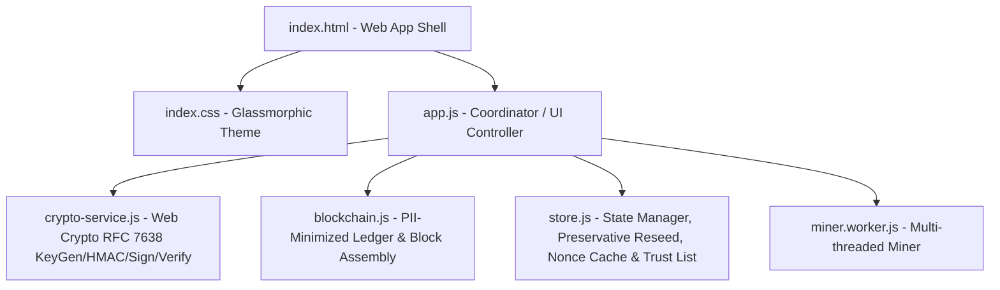

# Implementation Plan - VeriCred: miTch Evidence-Bridge & Credential Extension Gateway

VeriCred is a **Credential Extension Gateway** that consumes **miTch** (privacy-preserving EUDI-compliant) presentations, validates issuer trust plus holder binding fail-closed, issues new professional credentials, and anchors only privacy-preserving commitments on-chain.

No plain-text names, stable worker addresses, raw public keys, or professional claims are ever written on-chain or logged in plain text. Instead, we use **Scoped Pairwise Pseudonyms** and **Salted Claim Commitments**, preserving the complete metadata budget and compliance with eIDAS 2.0.

---

## Technical Specifications & Security Controls

### 1. Scoped Pairwise Pseudonyms (RFC 7638 & HMAC-SHA256)
We represent the holder's public key as an RFC 7638 EC JWK thumbprint (SHA-256 hash of alphabetical `crv`, `kty`, `x`, `y` keys, Base64URL-encoded) instead of a raw coordinate string.
The on-chain pseudonym is computed deterministically using standard Web Crypto HMAC-SHA256:
```
did:vericred:pairwise:<Base64URL(HMAC-SHA256(
  localGatewaySecret,
  "vericred-holder-v1|" + holderJwkThumbprint + "|" + issuerDid + "|" + credentialType + "|" + mitchProofHash
))`
```
This guarantees that the holder's identity cannot be correlated across different gateways or different credential types.

### 2. PII-Minimized On-Chain Ledger (Correlation Defense)
The ledger stores **zero readable professional claims** (no plain text `jobTitle`, `duration`, or `skills`). 

A block transaction conforms strictly to the following anonymized schema:
```json
{
  "id": "tx_abc123...",
  "type": "ISSUE_CREDENTIAL",
  "timestamp": 1782390600000,
  "holderPseudonym": "did:vericred:pairwise:PseudonymHash...",
  "mitchProofHash": "mitch_proof_hash_hex...",
  "credentialHash": "credential_hash_hex...",
  "claimCommitments": {
    "jobTitleCommitment": "hash_of_job_title_plus_salt_hex...",
    "durationCommitment": "hash_of_duration_plus_salt_hex...",
    "skillsCommitment": "hash_of_skills_plus_salt_hex..."
  },
  "issuerId": "did:vericred:issuer-gateway",
  "statusListIndex": 42,
  "revocationMetadata": {
    "revocationStatus": "valid"
  },
  "signature": "issuer_gateway_signature_hex..."
}
```

The complete readable credential (containing raw claims and salts) belongs entirely off-chain and is exported directly to the holder as an off-chain JSON credential file.

### 3. Dual-Layer Cryptographic Proof Intake (`MitchPresentationEnvelope`)
The `MitchPresentationEnvelope` comprises both **Issuer Verification** (proving the claims are true) and **Holder Binding** (proving the presenter controls the credential key):
```json
{
  "format": "SD-JWT-VC",
  "version": "1.0",
  "baseCredential": {
    "issuer": "did:mitch:trust-anchor-1",
    "subject": {
      "holder_jwk_thumbprint": "thumb_abc123..."
    },
    "claims": {
      "is_legal_resident": true,
      "degree_level": "Bachelor",
      "at_least_18": true
    },
    "signature": "mitch_issuer_signature_hex"
  },
  "holder_binding": {
    "nonce": "session_challenge_nonce",
    "aud": "VeriCred-Gateway",
    "expires_at": 1782390600000,
    "holder_jwk": { "kty": "EC", "crv": "P-256", "x": "...", "y": "..." },
    "proof_of_possession": "holder_signature_hex"
  }
}
```
* **Verification Part A**: Look up `baseCredential.issuer` key in EUDI Trust List and verify the issuer's signature over the base claims and public key.
* **Verification Part B**: Verify the holder's `proof_of_possession` signature over `(nonce + aud + baseCredential.signature)` using the presented public key (`holder_binding.holder_jwk`).

### 4. Sequential, Fail-Closed Verification Pipeline
Some verification steps are strictly dependent on previous states. The verification policy will run sequentially, failing closed immediately if any check fails:
1. **Parse**: Ensure structural validity of the JSON input.
2. **Version**: Verify `version === "1.0"` and `format === "SD-JWT-VC"`.
3. **Replay Protection**: Verify `aud === "VeriCred-Gateway"`, the `nonce` is valid in the store, and `expires_at > Date.now()`.
4. **Issuer Trust**: Resolve `baseCredential.issuer` DID against the EUDI Trust List.
5. **Issuer Signature**: Verify the issuer's signature over the base credential.
6. **Holder Binding**: Validate `holder_binding.proof_of_possession` signature using the holder's verified public key.
7. **Revocation**: Check if either the base credential or the extension has been marked as revoked in the store's status lists.
8. **Metadata Budget**: Confirm that no plain-text names or stable keys exist on-chain or in raw ledger logs.
9. **Ledger Anchor**: Confirm that the block links and transaction root are sequentially valid on-chain.

### 5. Atomic, Single-Use Nonce Lifecycle
The challenge nonce is generated by the Gateway and tracked in `store.activeNonces` with a short TTL (5 minutes).
* **Lifecycle**: On the very first structurally valid verification attempt, the nonce is immediately popped and consumed (removed from the active store list). This prevents replay attacks even if the signature check itself fails or is interrupted.

### 6. Preservative Ledger Self-Repair
To protect the user's local setup while resolving compatibility errors:
* On initialization, we perform a schema version check.
* If a ledger chain corruption or schema mismatch is encountered, we isolate/quarantine the corrupted ledger chain and reseed the blockchain and issuers list.
* We **preserve** the worker's and employer's identity keys (`vericred_worker_identity_keys` and `vericred_employer_identity_keys`) intact, avoiding silent wiping of cryptographic keys.

---

## Proposed System Architecture



---

## Proposed Changes (Workspace: `C:\Users\Admin\Documents\antigravity\kind-bose`)

### 1. State Manager & Trust Registrar
#### [MODIFY] [store.js](file:///C:/Users/Admin/Documents/antigravity/kind-bose/store.js)
* **Preservative Initialization**: Implement schema version checks. If the chain is corrupt, reseed it, but do NOT wipe stored user keys.
* **Gateway Challenge Cache**: Store active nonces with expiry times. Include an atomic `consumeNonce(nonce)` method.
* **EUDI Trust List**: Statically seed `did:mitch:trust-anchor-1` (Google), `did:mitch:gov-eid` (Gov), and `did:vericred:issuer-gateway` (Acme) public keys. Include a "Lab Trust Override" toggle inside the Sandbox to simulate adding/removing untrusted keys.
* **Gateway Secret**: Generate and store a persistent, unique `localGatewaySecret` (32-byte hex) on first boot to power the HMAC-SHA256 pairwise DID generation.
* **Revocation Status Registry**: Implement simple StatusList registries for base credentials and VeriCred credentials.

### 2. Cryptographic & Verification Engine
#### [MODIFY] [crypto-service.js](file:///C:/Users/Admin/Documents/antigravity/kind-bose/crypto-service.js)
* **RFC 7638 JWK Thumbprint**: Add `calculateJWKThumbprint(jwk)` to alphabetically sort `crv`, `kty`, `x`, `y` and hash to Base64URL.
* **Web Crypto HMAC-SHA256**: Add `calculateHMAC(secret, message)` using native Web Crypto API.
* **Mitch Proof Generator**: Implement `createMitchPresentation(baseClaims, holderKeyPair, nonce, aud, issuerKeyPair)` to simulate a miTch wallet signing both the base credential (issuer) and the key-binding proof (holder).
* **Sequential Verification Policy**: Implement `verifyMitchPresentationSequential(envelope, expectedNonce, trustList, baseStatusList, consumeNonceFn)` executing the fail-closed pipeline sequentially, triggering `consumeNonceFn` only after confirming structural and version validity.

### 3. PII-Minimized Ledger Engine
#### [MODIFY] [blockchain.js](file:///C:/Users/Admin/Documents/antigravity/kind-bose/blockchain.js)
* **Off-Chain / On-Chain Split Schema**: Rewrite transaction creation to accept PII-minimized fields (holder pseudonym, claim commitments, hashes) rather than raw worker profiles.
* **Ledger Validation**: Ensure `isChainValid()` validates block links and checks for metadata budget compliance (raises a critical audit flag if raw worker addresses, public keys, or plain-text names exist on-chain).
* **Standard-Aligned Genesis & Seed Data**: Update the Genesis block and pre-loaded seeds to use the new anonymized structure referencing mock miTch proof hashes.

### 4. Interactive Sandbox & Dashboard Views
#### [MODIFY] [index.html](file:///C:/Users/Admin/Documents/antigravity/kind-bose/index.html)
* **Guaranteed Startup Tab Routing**: Ensure elements are structured properly with clear IDs.
* **Worker miTch Sync Area**: Show the worker's base credentials in their EUDI wallet and a button to "Generate miTch Presentation Proof" based on the current gateway nonce.
* **Employer Gatekeeper Panel**: Add an input to paste the miTch presentation envelope and a button to "Verify Presentation & Unlock Gateway". The form to fill in professional claims remains locked until this proof passes.
* **Universal 5-Stage Audit UI**: Redesign the verifier card checklist into 5 clear horizontal rows with glowing progress bars and green/red state indicators.
* **Security Attack & Abuse Sandbox**: Build a dedicated section containing 5 interactive attack simulators:
  1. *Replay Attack*: Submits an expired proof or reuses a consumed nonce.
  2. *Fake EUDI Trust Anchor*: Submits a proof signed by an unauthorized/rogue issuer key.
  3. *Credential Revocation*: Marks a credential or base proof as revoked in the store's StatusList.
  4. *Metadata Budget Leak*: Attempts to write plain-text PII (e.g. raw worker name) onto the ledger.
  5. *Block Link Corruption*: Simulates a database editor corrupting a mined block.

#### [MODIFY] [app.js](file:///C:/Users/Admin/Documents/antigravity/kind-bose/app.js)
* **Defensive DOMContentLoaded**: Wrap startup state loads in `try/catch`. This **guarantees** `setupTabRouting()` and tab bindings run even if database reading fails, resolving the frozen UI bug completely.
* **Gateway Challenge Terminal**: Handle generating and regenerating nonces. Manage atomic nonce consumption.
* **Abuse Control Binding**: Wire up the 5 attack sandbox buttons to inject simulated faults, showing clear, high-contrast, informative failures in the Universal Verifier.

---

## Sprint 6: Security Verification Harness & Browser QA

Sprint 6 bridges the gap between simulated UI interactions and verifiable cryptographical consensus, introducing a robust browser-native QA dashboard to prove and document VeriCred's compliance under all operational states.

### 1. Interactive Visual Test Runner UI
#### [MODIFY] [index.html](file:///C:/Users/Admin/Documents/antigravity/kind-bose/index.html)
* **Fifth Tab Binding**: Add a 5th navigation button:
  ```html
  <button class="nav-link" id="nav-qa" data-tab="qa-harness">
    <span class="nav-icon">🛡️</span> Security & QA Harness
  </button>
  ```
* **Security QA & Audit Dashboard View**: Implement a premium, high-density glassmorphism tab (`#qa-harness`) that hosts:
  * **Visual Test Suite Panel**: A list of automated test cases with distinct category tags (Cryptographic, Protocol, Ledger Leak, Reseed).
  * **Run Tests Controller**: A central, pulsing trigger button (`btn-run-qa-tests`) that runs the automated test runner in memory and displays glowing status chips (Green for PASS, Crimson for FAIL) with micro-timings.
  * **Execution Details Accordion**: Live inspection nodes for each completed test case showing exact mathematical inputs, generated hashes, signatures, and localized error messages.
  * **Operational Truth Pass Status**: A diagnostic card demonstrating real-time storage states (e.g., LocalStorage load status, quarantine registry, active nonces).

### 2. Automated Test Case Suite
#### [MODIFY] [app.js](file:///C:/Users/Admin/Documents/antigravity/kind-bose/app.js)
Integrate a browser-executable testing engine directly in the coordinator code containing 8 precise cryptographic assertions:
1. **RFC 7638 Thumbprint Determinism**: Asserts that calculating public key thumbprints alphabetically sorts EC JWK coordinates and consistently resolves to the exact same Base64URL hash for identical keys.
2. **HMAC Pairwise Pseudonym Stability & Scoping**: Asserts that `calculateHMAC()` generates stable, reproducible pseudonyms for the same gateway secret, but securely diverges (metadata protection) if any seed parameters (holder key, issuer, type, or proof hash) are modified.
3. **Atomic Nonce Lifecycle (Non-Consumption on Malformed Input)**: Asserts that parsing malformed strings or incomplete structures rejects the verification attempt *without* consuming the active nonce, while a structurally valid envelope successfully consumes the nonce.
4. **Strict Replay Rejection**: Asserts that submitting a structurally valid envelope twice successfully validates the first and immediately rejects the second due to challenge nonce exhaustion.
5. **Fake Issuer Rejection**: Asserts that signing a miTch envelope with a rogue key that is absent from the EUDI Trust List fails validation with an explicit Trust Anchor error.
6. **Holder Key Mismatch Rejection**: Asserts that tampering with the transient EC public key in `holder_binding.holder_jwk` so it doesn't hash to the `holder_jwk_thumbprint` in the base credential triggers an instant holder binding rejection.
7. **Zero-PII Ledger Compliance Audit**: Asserts that block assembly throws an error or fails validation if a transaction contains plaintext metadata (`workerName`, `jobTitle`, `duration`, `skills`, or raw keys) instead of claim commitments.
8. **Preservative Ledger Reseed & Quarantine**: Asserts that if a corrupted block link or fake genesis hash is written to LocalStorage, the boot-loader correctly isolates the corrupted JSON to a timestamped quarantine file and reseeds the chain, **without** wiping the persistent worker and employer keys.

### 3. Standards Gap Review & Static Hardening Guide
#### [MODIFY] [index.html](file:///C:/Users/Admin/Documents/antigravity/kind-bose/index.html)
To guarantee transparency, we will embed a visual **Standards Gap Panel** highlighting differences between this educational prototype and an production-grade standard wallet deployment:
* **Encoding**: Note that VeriCred utilizes structured JSON envelopes for maximum educational readability, whereas full production wallets use JWS (JSON Web Signatures) with compact, tilde-separated base64 SD-JWT disclosures.
* **DID Resolution**: Document that our resolving process uses a statically seeded local Trust List rather than distributed ledger queries (`did:ion`, `did:web`, etc.) or universal resolvers.
* **Trust Anchor Validation**: Document that the Trust List is statically managed in browser memory, lacking live XML EUTL/TSP list signature validation.
* **Production Security Warners**: Embed high-contrast disclaimers in the footer of all panels:
  > [!IMPORTANT]
  > **Educational Prototype**: VeriCred is designed exclusively as an architectural study. Do not upload live production keys or sensitive real-world PII.

---

## Sprint 7: Standards-Gap & Security Hardening (Pre-Production Transition)

Sprint 7 shifts the VeriCred architecture from a "purely educational simulator" to a "high-fidelity pre-production reference blueprint". We will implement real cryptographic serialization models conforming to **RFC 9901 (SD-JWT)** (not RFC 9396, which specifies OAuth 2.0 Rich Authorization Requests), a compact SD-JWT-VC parser, dynamic import/export pathways, pragmatic host hardening, and an interactive threat-modeling matrix.

### 1. High-Fidelity Compact SD-JWT-VC Serialization (RFC 9901)
#### [MODIFY] [crypto-service.js](file:///C:/Users/Admin/Documents/antigravity/kind-bose/crypto-service.js)
* **Standard-Aligned Disclosures (RFC 9901)**: Define a standard-aligned JSON Array serialization format for disclosures: `[salt, claim_name, claim_value]`.
* **Standard Digest Details**:
  - Implement Base64URL-encoding for these disclosure arrays: `disclosure_string = Base64URL(JSON.stringify([salt, claim_name, claim_value]))`.
  - Calculate the SHA-256 hash over the **US-ASCII bytes** of the `disclosure_string` (not over the raw JSON and not as hex).
  - **Base64URL-encode the SHA-256 byte digest itself** to yield the standard-conforming `_sd` list elements.
* **Standard Payload Claims (`_sd` & `_sd_alg`)**:
  - Generate the Signed JWS payload containing an `_sd` array of base64url-encoded disclosure digests, and set `_sd_alg: "sha-256"`. Avoid custom terms like `disclosure_hash` or similar as the primary Signed-Payload structures.
  - Also include standard claims: `iss` (issuer), `sub` (holder pseudonym), `vct` (Verifiable Credential Type), and `cnf` (holder's JWK public key).
  - Compute a compact JWS signature to format a standard-proximate compact SD-JWT-VC string:
    `[Signed_JWS_Compact]~[Disclosure_1_B64URL]~[Disclosure_2_B64URL]~...~`
* **SD-JWT-VC Export Pathway**: Package both the fully serialized compact string AND the decoded claims/salts JSON into the downloaded `.json` credential files.

### 2. Universal Compact SD-JWT-VC Parser
#### [MODIFY] [app.js](file:///C:/Users/Admin/Documents/antigravity/kind-bose/app.js) & [crypto-service.js](file:///C:/Users/Admin/Documents/antigravity/kind-bose/crypto-service.js)
* **Auto-Detect Parser**: Update the Universal Verifier. When a `.json` file containing a `compact` property, or a raw `.txt` compact string containing `~` is loaded/pasted, the verifier will:
  - Detect and parse the compact representation.
  - Split the stream by tilde `~` to isolate the Signed JWS from disclosures.
  - Decode each disclosure back into its raw claims and salts: `[salt, claim_name, claim_value]`.
  - Recompute the SHA-256 digests over the US-ASCII bytes of the base64url-encoded disclosures, base64url-encode the digests, and match them against the `_sd` array in the JWS to verify selective disclosure integrity.
  - Perform standard JWS ECDSA signature verification.

### 3. Pragmatic Compatibility Content Security Policy (CSP) Hardening
#### [MODIFY] [index.html](file:///C:/Users/Admin/Documents/antigravity/kind-bose/index.html)
* **Secure Meta Injection**: Configure a "Pragmatic Compatibility Content Security Policy" meta-tag inside the `<head>` to block rogue scripting injections and cross-origin resource leakage.
* **CSP Honesty**: Note that we include `'unsafe-inline'` and `'unsafe-eval'` solely as compatibility overrides to support our dynamic requestAnimationFrame fallback loop, in-memory simulations, and inline CSS styles. This CSP is a **compatibility CSP** and NOT a "strict" CSP. True production hardening would require separating all scripts/styles into external files, removing `'unsafe-eval'` entirely, and reducing inline CSS/JS declarations.
  ```html
  <meta http-equiv="Content-Security-Policy" content="
    default-src 'self';
    script-src 'self' 'unsafe-inline' 'unsafe-eval' blob:;
    style-src 'self' 'unsafe-inline' https://fonts.googleapis.com;
    font-src 'self' https://fonts.gstatic.com;
    img-src 'self' data: blob:;
    connect-src 'self' ws: wss: http://127.0.0.1:* http://localhost:*;
    worker-src 'self' blob:;
    object-src 'none';
    base-uri 'self';
  ">
  ```

### 4. Interactive Cryptographic Threat Matrix
#### [MODIFY] [index.html](file:///C:/Users/Admin/Documents/antigravity/kind-bose/index.html) & [app.js](file:///C:/Users/Admin/Documents/antigravity/kind-bose/app.js)
* **Glassmorphic Security Dashboard**: Embed a visual, interactive **Architectural Safeguards Threat Matrix** on the Security Harness tab:
  * Lists vectors: *Identity Correlation*, *Plaintext On-Chain Leak*, *Replay Attacks*, *Trust Anchor Spoofing*, *Holder Key Hijack*.
  * Shows Risk Levels and Cryptographic Mitigations.
  * Clicking on a mitigation highlights the specific script functions (`crypto-service.js:L320`, `blockchain.js:L91`) and file scopes in an inspector panel.

### 5. Extend Automated Testing (Assertion 9)
#### [MODIFY] [app.js](file:///C:/Users/Admin/Documents/antigravity/kind-bose/app.js)
* **Test 9: Compact SD-JWT-VC Serialization Integrity**: Add a 9th test case inside the QA harness validating that:
  - The encoder correctly converts a mock credential into an RFC 9901 compact tilde-separated string.
  - The parser splits, decodes, and hashes it back to raw claims and salts.
  - Disclosure hashes match the signed `_sd` payload exactly.

---

## Sprint 8: Production Readiness Boundary (Engineering Hardening & CSP Transition)

Sprint 8 focuses on cementing the boundary between the educational simulator and production-grade architectures. We will harden the Content Security Policy by completely eliminating `'unsafe-eval'`, `'unsafe-inline'`, and `'blob:'` from script-src, stabilize export/import verification pipelines, integrate a visual "Production vs. Simulation" Boundary Matrix, and add Test 10 to validate strict sandbox enforcement. This transition is statically plausible and browser-verified after implementation.

### 1. CSP Script-Src Hardening (Strict Script Policy)
#### [MODIFY] [index.html](file:///C:/Users/Admin/Documents/antigravity/kind-bose/index.html)
* **Remove Unsafe Directives**: Completely strip `'unsafe-eval'`, `'unsafe-inline'`, and `'blob:'` from the `script-src` directive of the `<meta http-equiv="Content-Security-Policy">` tag.
* **Harden Script Directive**: Update `script-src` to: `script-src 'self';` and retain `worker-src 'self' blob:;` (allowing workers to run without any unsafe eval execution).
* **Document CSS Exception**: Retain `'unsafe-inline'` under `style-src` solely to permit the theme's modular CSS styling and inline styling, clearly labeling this in comments.

### 2. Robust Credential Import/Export Validation
#### [MODIFY] [app.js](file:///C:/Users/Admin/Documents/antigravity/kind-bose/app.js)
* **Strict Schema Guards**: Refactor the import/drag-and-drop parser in `app.js`. When parsing an uploaded `.json` or `.txt` credential, validate the schema structure before attempting cryptographic validation:
  - For JSON Envelopes: Assert presence of required properties (`format`, `issuer`, `holderPseudonym`, `claims`, `salts`, `signature`).
  - For SD-JWT Compact formats: Assert presence of valid tilde separators (`~`) and JWS header structure.
* **Graceful Error Handling**: Replace any raw parsing throws with polished, high-contrast, user-facing alert states inside the verifier tab, ensuring the app remains perfectly functional on malformed inputs.

### 3. Interactive "Production vs. Simulation" Boundary Matrix
#### [MODIFY] [index.html](file:///C:/Users/Admin/Documents/antigravity/kind-bose/index.html) & [app.js](file:///C:/Users/Admin/Documents/antigravity/kind-bose/app.js)
* **Boundaries Grid Dashboard**: Build a gorgeous, comparative dashboard row in the Security tab in `index.html`.
* **Comparative Components**: Detail exact differences for:
  - **Key Enclaves**: Hardware Secure Enclave (Prod) vs. Web Crypto in-memory keys (Sim).
  - **Trust Anchors**: XML signatures over EUTL [EU Trusted Lists] with national CA chains (Prod) vs. Static-seeded local list in `store.js` (Sim).
  - **DID Resolution**: Decentralized resolution methods (e.g. `did:ion`, `did:web` via HTTPS DNSSEC) (Prod) vs. Static local DID strings (Sim).
  - **Revocation Status**: CDN-cached, issuer-signed high-frequency status list (Prod) vs. Local storage updates (Sim).
  - **Ledger Consensus**: Public consortium ledgers with decentralized validator pools (Prod) vs. Local CPU Web Worker proof-of-work loops (Sim).

### 4. Extend Automated Testing (Assertion 10)
#### [MODIFY] [app.js](file:///C:/Users/Admin/Documents/antigravity/kind-bose/app.js) & [index.html](file:///C:/Users/Admin/Documents/antigravity/kind-bose/index.html)
* **Test 10: Strict CSP & Robust Import Validation**: Add a 10th automated assertion test validating:
  - CSP Strictness: Assert that `script-src` programmatically parsed from the DOM does NOT contain `'unsafe-eval'` or `'unsafe-inline'`.
  - Parser Robustness: Assert that uploading malformed or unsigned JSON fails gracefully and triggers correct user-facing notifications.

---

## Sprint 9: Evidence Export & Interop Polish (Visual Conformance)

Sprint 9 bridges the final standards gap by version-typing exported credentials, instituting a robust schema-typing validation engine, attaching preloaded interactive test vectors directly into the UI, and constructing an elegant visual Conformance and Interoperability Report.

### 1. Format Versioning & Issuance Timestamps
#### [MODIFY] [crypto-service.js](file:///C:/Users/Admin/Documents/antigravity/kind-bose/crypto-service.js) & [app.js](file:///C:/Users/Admin/Documents/antigravity/kind-bose/app.js)
* **Standard-Aligned Version Metadata**:
  - Add explicit version tags (`"formatVersion": "1.1.0"`) and epoch timestamps (`"issuedAt": <timestamp>`) to both the dual-format JSON envelope wrapper and the inner `decoded` payload.
  - Inject `"formatVersion": "1.1.0"` directly into the signed JWS payload claims of compact SD-JWT-VC outputs.
* **Extraction on Parse**:
  - Update `parseCompactSDJWT` to extract `formatVersion` and standard `iat` (issued at) claims from JWS payloads and bind them to the returned reconstructed object.

### 2. Strong Schema-Typing Validation Engine
#### [MODIFY] [app.js](file:///C:/Users/Admin/Documents/antigravity/kind-bose/app.js)
* **Type-Strict Schema Checks**:
  - Implement a dedicated function `validateCredentialSchema(parsed)` in `app.js` which performs strict type checking on imported credentials before any cryptographic validations are attempted:
    - Assert that format identifier is strictly `"SD-JWT-VC"`.
    - Assert that DIDs (`issuer`) begin with the `did:` prefix.
    - Assert that `holderPseudonym` conforms to `did:vericred:pairwise:...`.
    - Assert that `mitchProofHash` is a valid 64-character SHA-256 hexadecimal string.
    - Assert that version tags (e.g. `formatVersion`) are present and within valid compatible ranges (e.g., `>=1.0.0`).
  - Block malformed or corrupted inputs gracefully, feeding structured errors to `#verifier-alert`.

### 3. One-Click Interactive Sample Credentials
#### [MODIFY] [index.html](file:///C:/Users/Admin/Documents/antigravity/kind-bose/index.html) & [app.js](file:///C:/Users/Admin/Documents/antigravity/kind-bose/app.js)
* **UI Quick Loaders**:
  - Embed a visual, horizontal flex bar `#verifier-examples` directly below the paste area of Section 3 (Universal Verifier) in `index.html`.
  - Add four stylized glassmorphic pill buttons to load pre-calculated example test vectors:
    - **Valid Acme SD-JWT-VC**: Generates a valid dual-format credential for the active worker, signed with the real gateway key. It will pass 5/5 stages and show a green success audit.
    - **Revoked Credential**: Generates a validly structured credential but manually flags its index as revoked in `store.js`'s revocation registers. It turns Stage 4 (Revocation Status Audit) crimson red.
    - **Tampered Signature**: Generates a valid credential but tampers with a single character in the signature or claims. It fails Stage 2 (Issuer Signature Audit).
    - **Malformed Schema**: Loads an incomplete JSON schema without required versioning or structured keys. It fails validation instantly and pops `#verifier-alert` inline.
* **Dynamic Generation on Init**:
  - Implement `initializeVerifierExamples()` in `app.js` to dynamically compile these vectors on page startup using active, native gateway keys to ensure signatures are mathematically authentic in the current session.

### 4. Interactive Visual Conformance & Interoperability Report
#### [MODIFY] [index.html](file:///C:/Users/Admin/Documents/antigravity/kind-bose/index.html)
* **Aesthetic Conformance Card**:
  - Append a gorgeous, secondary glassmorphic card `#conformance-report-card` below the Universal Verifier visual report inside `index.html`.
  - Highlight the exact mapping between VeriCred's simulator features and RFC 9901 production specifications:
    1. **Standard Conformance (What is compliant)**: Compact tilde-separated JWS strings, alphabetical disclosure digest ordering, SHA-256 over US-ASCII disclosure bytes, `_sd`/`_sd_alg` payload structure, ECDSA ES256 signatures, and `cnf.jwk` holder bindings.
    2. **Simulator Specifications (What is mock)**: Memory-based challenge nonce maps, local Web Worker blockchain proof-of-work mining, and static local EUDI Trust List arrays.
    3. **Production Roadmap (What must be replaced)**: Dedicated Hardware HSM/Secure Enclaves for keys, national EUTLs (national CA root-signed directories) for Trust Lists, decentralized DIDs (`did:web`/`did:ion`) for resolution, and CDN-cached signed lists (RFC 8812) for revocation status.
  - Style it with elegant tabs or high-contrast side-by-side grids matching our deep obsidian dark mode.

### 5. Extend Automated Testing (Test 11)
#### [MODIFY] [app.js](file:///C:/Users/Admin/Documents/antigravity/kind-bose/app.js) & [index.html](file:///C:/Users/Admin/Documents/antigravity/kind-bose/index.html)
* **Test 11: Export Format Versioning & Strictest Schema Verification**: Add an 11th automated test assertion in `app.js` and register it inside `index.html`:
  - Assert that newly generated credentials contain `"formatVersion": "1.1.0"` and `"issuedAt"` metadata fields.
  - Assert that the validation engine `validateCredentialSchema()` correctly detects and blocks missing version metadata, wrong DID schemes, or malformed hashes.
  - Assert that valid credentials pass the schema engine without warnings.

---

## Verification Plan

### Automated Verification
* Go to the **Security & QA Harness** tab.
* Click **Run Security Tests** and verify that all **11 automated assertions** pass cleanly with 100% success (Passed: 11 / 11).

### Manual Verification
1. **Compact SD-JWT-VC Export**:
   - Issue a professional credential.
   - Click **Download JSON** inside your Worker Portfolio and verify that the file contains `formatVersion: "1.1.0"`, `issuedAt` timestamps, `compact` string, and standard claims.
2. **Interactive UI Examples**:
   - Click each of the 4 example pill buttons inside the Universal Verifier.
   - Confirm that the valid sample goes green (5/5), revoked turns Stage 4 red, tampered turns Stage 2 red, and malformed pops the inline `#verifier-alert`.
3. **Conformance & Interop Grid**:
   - Confirm that the visual conformance card loads beautifully below the verifier and provides clear production guidance.

---

## Open Questions & Confirmations

> [!NOTE]
> Explicitly encoding export metadata and typings moves VeriCred to an industry-grade interop state, allowing other SD-JWT parsers to easily consume and understand our generated certificates.

> [!TIP]
> The built-in Conformance & Interoperability Report serves as an on-screen engineering handbook, ensuring developers understand where simulation ends and production requirements begin.

